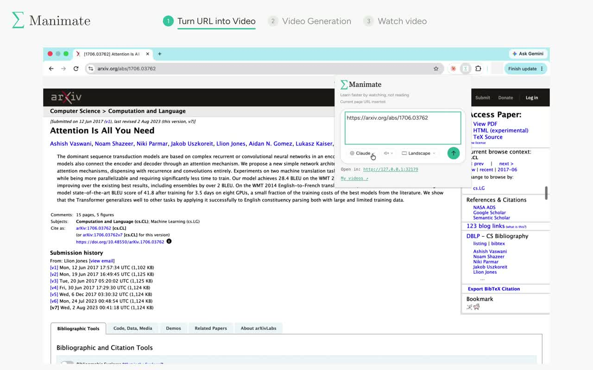

# Manimate in Chrome

Send a webpage or prompt to your local Manimate workspace, and open your saved Manim Cloud videos.

[Watch the demo](https://youtu.be/RDOpsAR9iUI): open a paper, click Manimate, and press Send. Generation and playback are sped up as labeled.

## Install

1. Open `chrome://extensions`, enable Developer mode, choose **Load unpacked**, and select this folder.
2. Open the extension and click **Start Manimate**.
3. On your first visit, copy its command into a terminal. Choose local rendering or sign in to Manim Cloud with Google.
4. After setup, **Start Manimate** starts the installed app and opens your workspace. No terminal is needed for ordinary launches.

The bundled public manifest key keeps the unpacked extension ID stable. When publishing to the Chrome Web Store, register that store ID with the native host. The first-install command includes the active extension ID automatically.

## Behavior and verification

The popup probes ports 32179–32198 and accepts only the Manimate discovery marker from `/api/status`. If the app is stopped, the native messaging host accepts only a fixed `start` operation. Prompt text never becomes a shell command. The launch page waits for readiness and then transfers the prompt, selected model, voice, and aspect ratio to the local workspace. If setup is required, the same page shows the one-time terminal command and resumes automatically when Manimate starts.

**My videos** opens the Google-authenticated library at https://manimate.ai/library. There is no hosted-chat fallback.

Run `node --test tests/*.test.mjs` for local discovery checks. Native messaging requires the host installed by Manimate and an extension reload after manifest changes.
